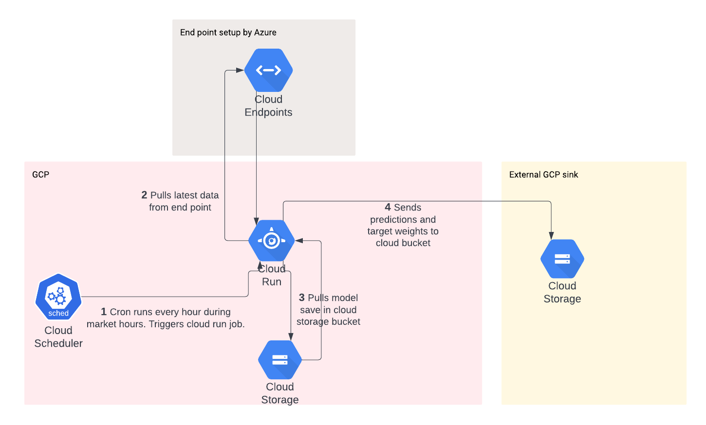
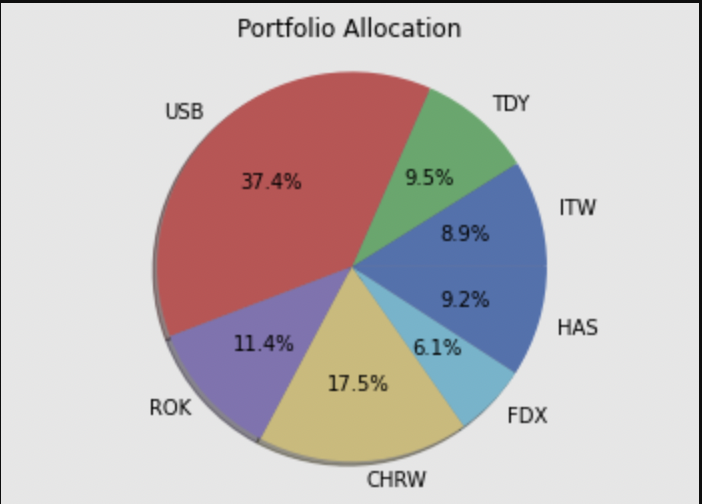
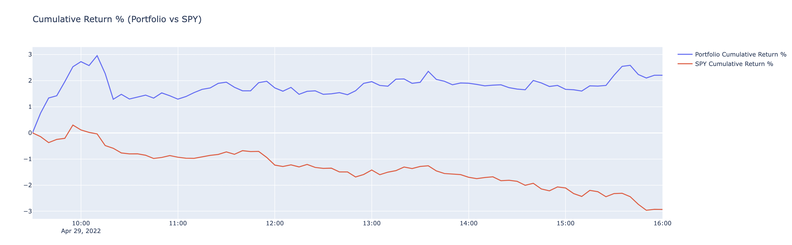
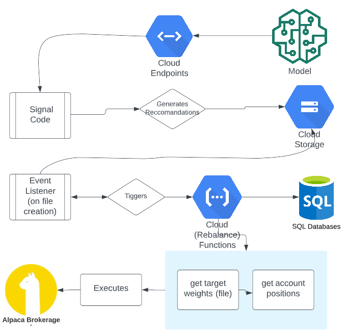
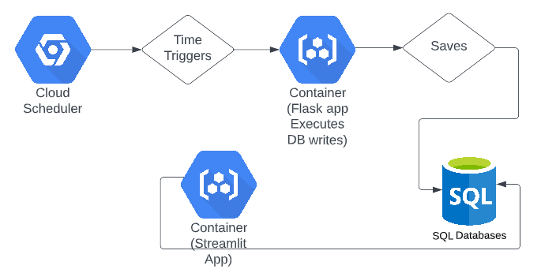
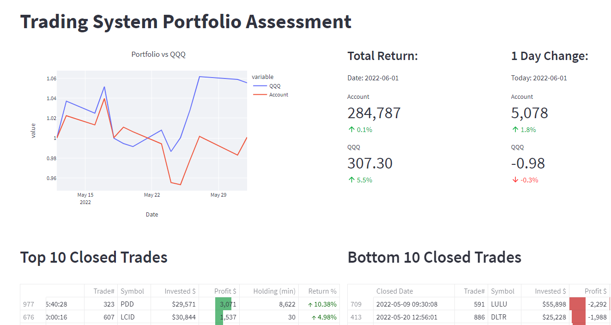

# Stock Trading App

* Create local copy 
* Recommend using virutal env 
* run `make all` before commiting

# Automated stock trading
----

**Summary**

This application was developed as part of Northwestern data science capstone group project. 

**Objective** 

To develop an end-to-end automated trading system that uses a time series model to make predictions for S&P stocks for the next market trading hour. The stock purchase / sell decisions are represented by a recommended portfolio weighting. A seperate service automates the portfolio rebalancing process and execute the trades in paper trading account. The fully automated application is deployed in google cloud. 

  
## Components
------

To enable portfolio recommendations, stock data is collected on the S&P 500 every 5 minutes. The data are used to make stock predictions for the upcoming hour (in 5-minute increments). The prediction data are combined with volatility data to find an optimally  weighted portfolio. The optimization is based on a sharpe ratio which finds the best expected return for given level of risk.

- **[Mark to include Database + ETL Detail]**

- **Model Training** -  There were multiple models used for training. All were based on N-BEATS architecture (https://arxiv.org/abs/1905.10437). The two main models trained were daily stock data and 5 minute stock data. The later was used for production. Models were trained using google colab + GPUs. Training required data historical S&P data. Specifically price data for given intervals. 
- **Predictions** - Once the production model was trained. It was deployed to a google cloud cloud storage. In production, the model is accessed and loaded. Input to the model is collected from end points generated by the database. 
- **Target Portfolio Allocation** -  Logic is included to generate an optimal portfolio using by solving for the maximum sharp ratio. For more detail on Model Training, Predictions, and target allocation setting see sections below or (https://github.com/enisbe/stock-trading-app/blob/main/model/README.md)
- **Trade Execution** - [Enis if you want to add a few sentences here, or a link ] 

## Data
-----
TODO

## Model and Weighting

----- 

### Portfolio Strategy Model

Portfolio strategy model uses predicted prices of stocks compositing S&P 500 as the base. Detailed instruction is saved in the model folder.

The model output would be a basket of selected stocks along with the weight of each selected stock as shown in below chart.

### Backtesting Model

Within the Portfolio opitmization model, backtesting of opitmized portfolio is conducted using historical data. The backtesting model assesses the profitability of the optimized portfolio strategy and provides a comparison between the performance of opitimized portfolio and the performance of benchmark index -- SPY. Below chart displays the result of portfolio backtesting in cumulative return term.

Rebalance and Execution
-----

Rebalance and execution is even-driven and function as a microservices application. Any file dropped in a target google cloud storage bucket (as long formatted and named correctly) will trigger rebalancing and execution process. This process is built and deployed as a cloud function. How to deploy the function can be found in [cf_rebalance folder](https://github.com/enisbe/stock-trading-app/tree/main/cf_rebalance). The process architecture is shown below.

 

Monitoring and Front-End
-----

Monitoring is a service designed to track account performance. Monitoring collects the information from the broker and saves it to the database. It is deployed as a cloud-run container and with a flask front end. The deployment link is found in [cf-monitor folder](https://github.com/enisbe/stock-trading-app/tree/main/cf_monitor).

 

Front-end is a service deployed as a [streamlit application](https://github.com/enisbe/stock-trading-app/tree/main/front_end). It connects to the database and calculates and displays the account performance.

 
