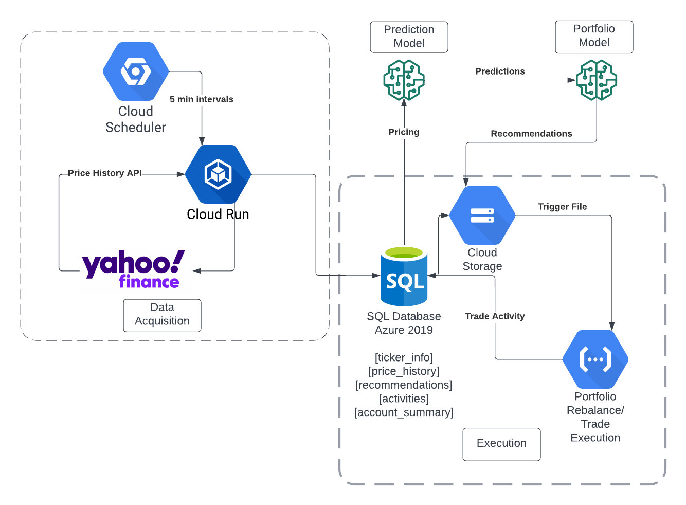
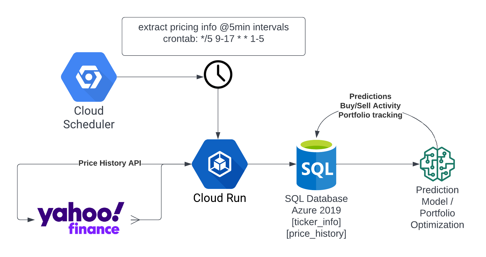

# ASTrA - Automated Stock Trading App

# Authors
----

- Enis Becirbegovic - EnisBecirbegovic2022@u.northwestern.edu
- Mark Stockwell - MarkStockwell2021@u.northwestern.edu
- Oliver Zarate - OliverZarate2021@u.northwestern.edu
- Siying Zhang - SiyingZhang2022@u.northwestern.edu
- 
**Summary**

This application was developed as part of (Northwestern Data Science)[https://sps.northwestern.edu/masters/data-science/curriculum-specializations.php] capstone group project. 

**Objective** 

To develop an end-to-end automated trading system that uses a time series model to make predictions for S&P stocks for the next market trading hour. The stock purchase / sell decisions are represented by a recommended portfolio weighting. A seperate service automates the portfolio rebalancing process and execute the trades in paper trading account. The fully automated application is deployed in google cloud. 

## Overview
------
 
ASTrA is a near real-time (~5 min latency) stock trading application that uses an NBeats (Neural basis expansion analysis for interpretable time series forecasting) deep learning machine learning algorithm to predict stock prices based on previous n periods. Stock predictions are fed into a portfolio optimization algorithm that uses Sharpe Ratios to minimize risk and maximize return. The process is as follows:

1. Google Cloud Scheduler is used to call a Cloud Run http endpoint every 5 minutes. The Cloud Run application takes a list of S&P 500 ticker symbols and retrieves the last 30 days of price history at 5 min intervals. This data is upserted to a SQL database (Azure).
2. Once the latest prices are available, the prediction model is called to calculate the expected price of each security over the next time period.
3. The predictions are passed to a second model which calculates the top 20 stocks to acquire and percent allocation for next time period.
4. A portfolio allocation file is uploaded to Google Cloud Storage, which triggers the trading execution Cloud Function. This function buys/sells securities as needed to achieve the desired allocation. Activity including details transaction history is written to the database for analysis. Upon completion of rebalance process an account summary with portfolio balance is also written.

  
## Components
------

To enable portfolio recommendations, stock data is collected on the S&P 500 every 5 minutes. The data are used to make stock predictions for the upcoming hour (in 5-minute increments). The prediction data are combined with volatility data to find an optimally  weighted portfolio. The optimization is based on a sharpe ratio which finds the best expected return for given level of risk.

- **[Mark to include Database + ETL Detail]**

- **Model Training** -  There were multiple models used for training. All were based on N-BEATS architecture (https://arxiv.org/abs/1905.10437). The two main models trained were daily stock data and 5 minute stock data. The later was used for production. Models were trained using google colab + GPUs. Training required data historical S&P data. Specifically price data for given intervals. 
- **Predictions** - Once the production model was trained. It was deployed to a google cloud cloud storage. In production, the model is accessed and loaded. Input to the model is collected from end points generated by the database. 
- **Target Portfolio Allocation** -  Logic is included to generate an optimal portfolio using by solving for the maximum sharp ratio. For more detail on Model Training, Predictions, and target allocation setting see sections below or (https://github.com/enisbe/stock-trading-app/blob/main/model/README.md)
- **Trade Execution** - [Enis if you want to add a few sentences here, or a link ] 

## Data Acquisition
-----
 

Data Acquisition ETL Workflow

1. A Cloud Run application written in Python/Flask uses the yfinance python package to extract price history for all 500 S&P stocks.
2. Price history is written to an Azure database using Microsoft ODBC drivers and pyodbc package. The process loads a temp table with a large amount of data, then loads the main table with any rows 
3. The Cloud Run application has a /dump_table function that simplifies data distribution to the prediction model, essentially an http data source.
4. A Cloud Scheduler job is called with a list of tickers to collect data. 10 jobs are configured to run simultaneously with 50 tickers each, completing in about 1 minute.

## Model and Weighting

----- 

### Portfolio Strategy Model

Portfolio strategy model uses predicted prices of stocks compositing S&P 500 as the base. Detailed instruction is saved in the model folder.

The model output would be a basket of selected stocks along with the weight of each selected stock as shown in below chart.

### Backtesting Model

Within the Portfolio opitmization model, backtesting of opitmized portfolio is conducted using historical data. The backtesting model assesses the profitability of the optimized portfolio strategy and provides a comparison between the performance of opitimized portfolio and the performance of benchmark index -- SPY. Below chart displays the result of portfolio backtesting in cumulative return term.

Rebalance and Execution
-----

Rebalance and execution is even-driven and function as a microservices application. Any file dropped in a target google cloud storage bucket (as long formatted and named correctly) will trigger rebalancing and execution process. This process is built and deployed as a cloud function. How to deploy the function can be found in [cf_rebalance folder](https://github.com/enisbe/stock-trading-app/tree/main/cf_rebalance). The process architecture is shown below.

 

Monitoring and Front-End
-----

Monitoring is a service designed to track account performance. Monitoring collects the information from the broker and saves it to the database. It is deployed as a cloud-run container and with a flask front end. The deployment link is found in [cf-monitor folder](https://github.com/enisbe/stock-trading-app/tree/main/cf_monitor).

 

Front-end is a service deployed as a [streamlit application](https://github.com/enisbe/stock-trading-app/tree/main/front_end). It connects to the database and calculates and displays the account performance.

 

Installation and Usage
-----

* Create local copy 
* Recommend using virutal env 
* run `make all` before commiting

