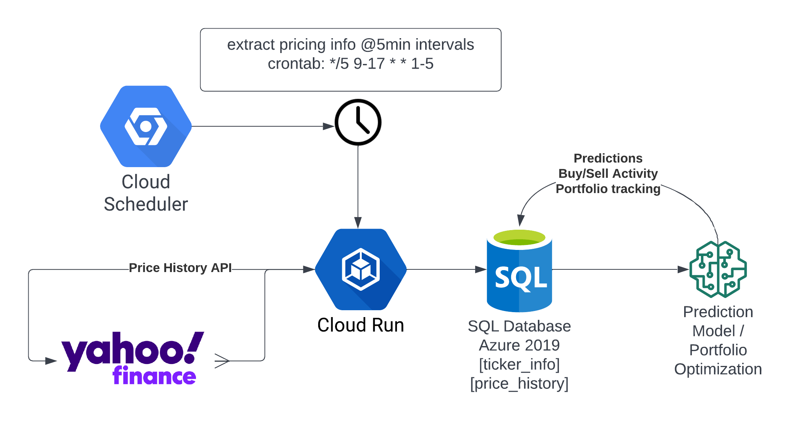

# yahoo_sp500_etl
This directory contains ETL routines to pull data from Yahoo Finance and load to Azure or other ODBC database. Process Flow:

## Setup
- Pull repo to local directory using git clone http://....
- setup Azure database, or use alternate ODBC connection. see [CreateAzureDB.ps1](CreateAzureDB.ps1)
- create an AZURE_CONN_STRING environment variable in format AZURE_CONN_STRING = "Driver={ODBC Driver 18 for SQL Server};Server=tcp:<yourservername>.database.windows.net;Database=stock_trading;Uid=azureuser;Pwd=<yourpw>;Encrypt=yes;TrustServerCertificate=no;Connection Timeout=30;"
- create tables in database using Azure Data Studio or other editor:
  - [sp500_ddl.sql](sp500_ddl.sql) - holds S&P 500 ticker list.
  - [ticker_info_ddl.sql](ticker_info_ddl.sql) - very wide table with detailed attributes/metrics for each ticker.
  - [price_history_ddl.sql](price_history_ddl.sql) - historical table with date/high/low/close info for each time period (5 min)
  - [price_history_tmp_ddl.sql](price_history_ddl.sql) - tmp transactional table with date/high/low/close info. This table is loaded every 5 min with a day's worth of data, then a merge_history function called to upsert rows into the main history table. An [idempotent](https://en.wikipedia.org/wiki/Idempotence) fault tolerant process.
- run gcloud init to authorize account and set default project/region
- deploy using "gcloud run deploy yahoosp500etl --source ." from source directory. This will build and deploy container in artifact registry on GCP.
- Add a secret called "AZURE_CONN_STRING" to secret manager: https://cloud.google.com/run/docs/configuring/secrets
  - Add the build service acct to secret https://cloud.google.com/build/docs/securing-builds/use-secrets
- Add secret to code build as env variable, see https://cloud.google.com/run/docs/tutorials/identity-platform#secret-manager

## Job Run setup
- The "gcloud scheduler jobs create" command is used, create from [CreateGcloudJobsCommandLinePriceHistory.sql](CreateGcloudJobsCommandLinePriceHistory.sql) and [gcloud_jobs_ticker_info.bat](gcloud_jobs_ticker_info.bat) note: the output of sql command becomes a batch file.
-  for 5 min updates during week the crontab is "\*/5 9-17 * * 1-5", meaning 
*“At every 5th minute from 1 through 59 past every hour from 9 through 17 on every day-of-week from Monday through Friday.”* see https://crontab.guru/#*/5_9-17_*_*_1-5
- verify the jobs are setup in the Cloud Scheduler UI and running correctly

## File Descriptions
- [main.py](main.py) - this file creates a flask app with following entry points:
  - / (root) : returns "hello world" to let you know it's there
  - /env : returns env variables for debug purposes
  - /test_conn : returns db info as connection test
  - /load_ticker_info : takes a series of pipe-delimited ticker symbols and loads the ticker_info table from yahoo finance API. Since metrics change, a load timestamp included.
  - /load_price_history - takes a series of pipe-delimited ticker symbols and loads the price_history table from yahoo finance API. Calls the load_price_history function then the merge_price_history function, then cleans up temp data.
  - /dump_table : takes 3 optional parameters for table|format [csv | json] | and where clause to dump a table to browser. The where parameter needs to include the WHERE keywork and be escaped.
  - /readme : returns this file
- [Dockerfile](Dockerfile) - standard docker build file with install commands for Microsoft ODBC drivers, pyodbc, and other dependencies.
